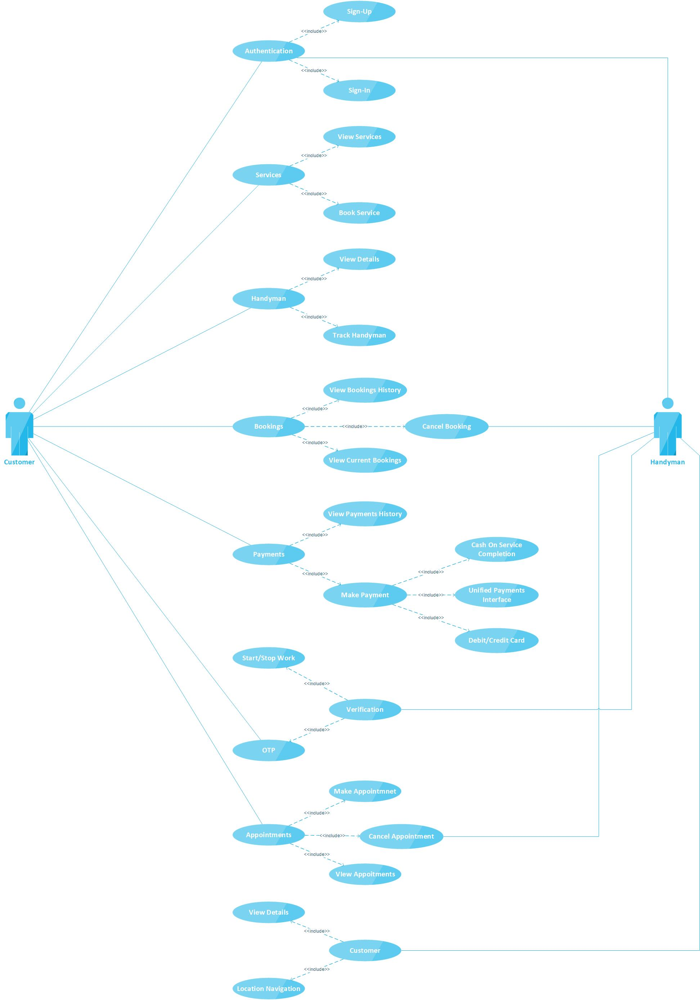

# **Handyman**

**Handyman is a mobile application which can be used by the people
to book (or) make an appointment for a home service such has electricians,
plumbers, appliance repair men, etc…The booking process of a handyman will be so simple which starts
by the customer by selecting a desired home service and selecting a handyman
with the help of google map which provides the details of handyman and the estimated
time of the handyman to reach customer house and at last complete the booking
by selecting payment method.Customers and Handyman could also keep a track of their
appointments though calendars and notifications.After booking a service a customer could track the respective
handyman through google maps and contact them personally with the given
handyman contact details for any further queries.These features will be obtained by developing a cross-platform
mobile application through Angular + Ionic and a backend server with NodeJS
with a Mongo Database.Our application is easy to use with the help of various components
to interact with system to achieve the desired functionally of the customer
such has appointments calendar, real-time google map handyman tracking and
navigation, easy app navigation through unique user interaction which consists
of various icons and valid typography, and secured services with handyman
verifications.Also, the cost to maintain this application will be low because we
should only deploy the backend to a public server along with the database and
the licencing prices for API's such has google maps and OTP services.**

#### **System Architecture Diagram :**

#### **Sample Usecase Diagram :**

